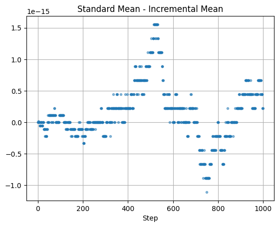
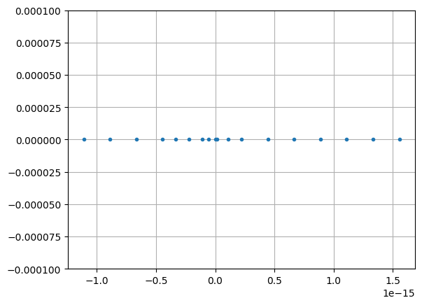
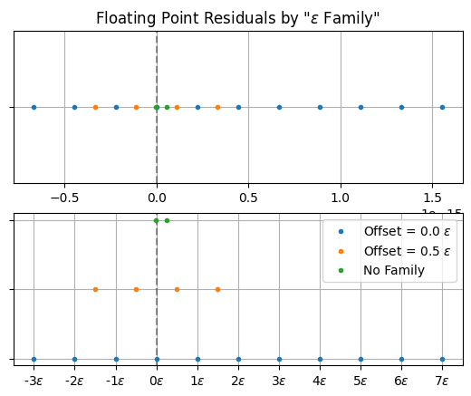

## What Do You Mean?

Recently, I was working on a side project writing a [multi-armed bandit simulator](https://github.com/acviana/multiarmed-bandit-simulation/tree/main) from scratch. Part of the code requires iteratively appending to a series of numbers and calculating the mean. It turns out that instead recalculating the mean over the entire series each time you can use a more computationally efficient [incremental mean](https://math.stackexchange.com/a/106720). Here what that looks like in Python:

```python
def incremental_mean(mean: float, observation: float, n: int) -> float:
    return mean + ((observation - mean) / n)
```

The benefit of using this incremental mean formula is that each incremental calculation is $\mathcal{O}(1)$ while calculating the mean of the entire series would be $\mathcal{O}(n)$. To see this, I benchmarked both methods with a series of 1000 randomly generated floats, once using my incremental mean function and once using the `statistics.mean` function from the Python Standard Library. Here are the results:


```python
%%timeit
[statistics.mean(input_list[0 : index + 1]) for index in range(len(input_list))
]
433 ms ± 62.2 ms per loop (mean ± std. dev. of 7 runs, 1 loop each)

%%timeit
rolling_incremental_mean(input_list)
513 µs ± 28.1 µs per loop (mean ± std. dev. of 7 runs, 1,000 loops each)
```
Fantastic, it's nearly 1000x faster! Great, we're done. 

_We were not done_

## What the Float?!?

I swapped in my faster incremental formula into my project, got the same results but faster, and moved on. But, while I was debugging a different error I decided to return to this function just to double-check. I tried to run an `assert` against the two outputs from my benchmark to confirm that they were the same and the test failed.

_No surprise, probably just a typo!_ 

Then I looped over the two outputs and checked them all pairwise. This time, it made it through a few dozen numbers before failing.

_That's weird, shouldn't the formula always be right or wrong?_ 

Then tried plotting the residuals (differences) between the two outputs and got this graph



_That's weird ... why are the errors quantized? Shouldn't they be - oh right, floats._ 

## We All Float On Alright

Here's what I thought was going on, to first order.

Numbers are infinite but computers are decidedly finite. This means any computational (physical) representation of the number line is going to have certain constraints. The most common representation computers use are called [floating-point numbers](https://en.wikipedia.org/wiki/Floating-point_arithmetic), or "floats". This represents every number as some real number of finite length raised to an exponent like this $123.456e^{10}$. 

Now here's where the constraints come in. Because the number of digits in the prefix to the exponent (also called the "mantissa") is limited, it means we can only construct a finite number of mantissas _per exponent_. That means that as the exponents get smaller, the numbers we can represent get closer and closer. The exponents themselves have a limited range (much less than the range of the mantissa) which means at some point we get to the smallest interval we can express in our floating point system.  

I'm hand-waiving away some details (which we'll return to later) but that's what went through my mind the first time I saw the graph of my residuals. I noticed the errors were on the order of $1e^{-15}$. This is effectively zero for my purposes, and figured I must have hit the floating point limit. I assumed there must be some rounding approximation in the standard library `statistics.mean` function or something.

Regardless of the details, this meant my function was correct so I could just stop there. 

_I did not stop there._

## Down the Rabbit Hole

I really wanted to get back to my main project, but now my interest was piqued. Could I _prove_ that this was just rounding errors on floating point math?

To start with, I confirmed that both the outputs each had 1000 distinct values which seemed normal. Now, how many different residual values were there?

```python
>>>len(residuals)
1000

>>>len(set(residuals))
18
```
OK, only 18 distinct values out of 1000. So now my suspicion is that this effect is being introduced when I subtract the two outputs. 18 isn't that many, let's take a look.

```python
>>>sorted(set(residuals))
  [-6.661338147750939e-16,
 -4.440892098500626e-16,
 -3.3306690738754696e-16,
 -2.220446049250313e-16,
 -1.1102230246251565e-16,
 -3.469446951953614e-18,
 0.0,
 5.551115123125783e-17,
 1.1102230246251565e-16,
 2.220446049250313e-16,
 3.3306690738754696e-16,
 4.440892098500626e-16,
 6.661338147750939e-16,
 8.881784197001252e-16,
 1.1102230246251565e-15,
 1.3322676295501878e-15,
 1.5543122344752192e-15]
```
Many of those seem suspiciously evenly spaced at something like $1.11e^{-16}$. You can see this more clearly if you plot them on a number line.



We can calculate the distances between points to make sure they're really the same.

```python
>>>residuals_set = sorted(set(residuals))
>>>set([
    residuals_set[i] - residuals_set[i + 1] 
    for i in range(len(residuals_set) - 1)
])

{-2.220446049250313e-16,
 -1.1102230246251565e-16,
 -1.0755285551056204e-16,
 -5.551115123125783e-17,
 -3.469446951953614e-18}
```

That seems promising, there are only 5 distinct distances. Maybe the smallest of those is the minimum floating point step size?

## An Epsilon of Delta

It turns out you can figure out the float properties of your system with the `sys.float` command.

```python
>>>import sys
>>>sys.float_info

sys.float_info(
    max=1.7976931348623157e+308, 
    max_exp=1024, 
    max_10_exp=308, 
    min=2.2250738585072014e-308, 
    min_exp=-1021, 
    min_10_exp=-307, 
    dig=15, 
    mant_dig=53, 
    epsilon=2.220446049250313e-16, 
    radix=2, 
    rounds=1
)
```

The value we care about is `epsilon=2.220446049250313e-16`. This value is on of our list of spacings, but confusingly it's not the smallest one. The Python docs define `float_info.epsilon` as:

> difference between 1.0 and the least value greater than 1.0 that is representable as a float.

OK, that definition seems consistent with the idea that we're hitting the lower limit of what we can represent with floats. It doesn't quite explain why I see values smaller than that but still, this seems like a reasonable place to stop!

_We're not stopping._

## Epsilon Families

If you squint at the list of distinct residuals you might notice a pattern that many of them are offset by the `float_info.epsilon` value. Actually, it looks like there are two "families" of residuals, each coming at intervals of `epsilon`, but with one family offset but 1/2 `epsilon`. This plot helps show that. 



The same data appears in both plots with the families are color coded. On the top they all appear on the same number line. On the bottom figure they are separated for clarity and expressed in units of epsilon. You can see the two families, their spacings and offsets, as well as the two points that don't fit into that scheme.

## It's Epsilons All The Way Down

At one point while working on this I remember thinking 

_Boy, it's lucky that these numbers were multiples of roughly 1.11 or I wouldn't have been able to spot the pattern! (e.g. 2.22, 3.33, etc.)_

Yeah, so about that. It turns out this ideas of epsilon "families" wasn't quite right, and the clue was in the remaining points that I thought didn't "fit" the pattern. After making lots more plots I finally realized that _all_ the errors can be expressed in units of epsilon. Take a look:

```python
>>>a = [
    -6.661338147750939e-16,
    -4.440892098500626e-16,
    -3.3306690738754696e-16,
    -2.220446049250313e-16,
    -1.1102230246251565e-16,
    -3.469446951953614e-18,
    0.0,
    5.551115123125783e-17,
    1.1102230246251565e-16,
    2.220446049250313e-16,
    3.3306690738754696e-16,
    4.440892098500626e-16,
    6.661338147750939e-16,
    8.881784197001252e-16,
    1.1102230246251565e-15,
    1.3322676295501878e-15,
    1.5543122344752192e-15,
]

>>> [item / sys.float_info.epsilon for item in a]
[-3.0,
 -2.0,
 -1.5,
 -1.0,
 -0.5,
 -0.015625,
 0.0,
 0.25,
 0.5,
 1.0,
 1.5,
 2.0,
 3.0,
 4.0,
 5.0,
 6.0,
 7.0]
```
OK so epsilon itself is not the smallest difference we can express (that was already clear). But it is the basis for representing all small differences because all our errors are some rational number times epsilon. For values larger than epsilon  the step size is $k \cdot \epsilon$ where $k$ is an integer. For values smaller than epsilon it's $\epsilon/2^{k}$ (e.g. 0.015625 is 1/64). So epsilon really _is_ the fundamental building block of small number representations (at least close to 0), which explains the quantization effect I saw. 

## At the Bottom of Everything

This is very much a inductive approach to understanding the problem, one where I'm working backwards from the data. I could come at this from deductive angle but I think that would involve reading IEEE specs, CS textbooks, and Python source code. All that sounds fun (seriously!) but I want to return to my main project of simulating multi-armed bandits. So, at least for now, this is proof enough for me.

_Now, we are finally done._

