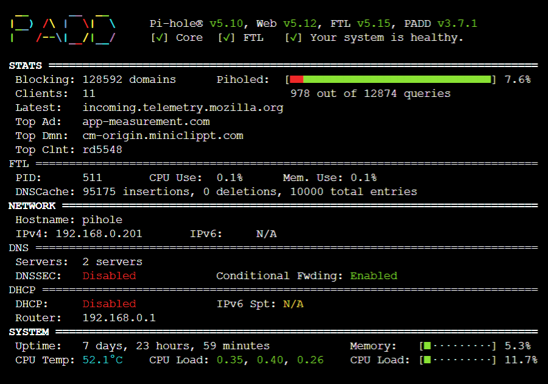

Early in the pandemic I got a Raspberry Pi and set it up to run [Pi-Hole](https://pi-hole.net/) as an ad blocker on my home network. In theory, it felt like a nice-to-have. But once you get used to surfing the web without walls of ads on almost every page - there’s no going back.

This weekend I decided to update the Raspberry Pi OS (formerly Rasbian).operating system on the Pi. Because I was going between major release versions this required a full reinstall and reconfiguration of my setup. But, as I’ve mentioned before, I really like rebuilding my tools up from scratch! It's more work but it helps remove old cruft and forces you to really understand how your systems work.

I took some notes so I wouldn't forget what I was doing and in the end I had enough for a quick post. These notes are more of a road map than a detailed guide. I figured between existing how-to guides, forums, and LLMs you should be able to work through any system-specific issues you run into. Good luck!

---

**The Task:** I wanted to upgrade my Rasbian OS version (now Raspberry OS) from one based on Debian 10 (”Buster”, released in 2019) to one based on Debian 12 (“Bookworm”, released in 2023). This will wipe my system so I will need to setup ad blocking on the Pi, [PADD](https://github.com/pi-hole/PADD) for visualization, and point my router at the Pi for DNS to complete the process.

**My Setup:** I’m running a 4 year old [CanaKit Raspberry Pi 4](https://www.canakit.com/raspberry-pi-4-starter-kit.html) with a 7” touchscreen display. I basically only use the system to run Pi-Hole so I run a distro without a desktop and set it to boot to the PADD utility which gives me a nice ASCII “dashboard” view of the network and system activity.



Every time I walk by my setup in the basement, as Marie Kondo would say, it sparks joy.

**Raspberry OS Upgrade:** Upgrading the OS requires etching a new ISO image on the MicroSD card. There are very clear warnings on the Raspberry OS site not to try and force an upgrade between versions from the CLI. I of course ignored the warnings and just tried to upgrade directly from CLI — and broke my install. `¯\_(ツ)_/¯`

For the new OS I used the 64-bit version of Raspberry OS Lite, which does not include the desktop. Using the Pi-specific disk image etcher from Raspberry Pi you need to enable SSH for remote access and you should pick a non-default a username and password to keep the script kiddies out. From here boot from the new disk image and do the usual software updates with `apt`.

**SSH Access:** If your machine now has a new IP address the SSH fingerprint will have changed and your next attempt to SSH will fail. Instead you'll get an error that starts `WARNING: REMOTE HOST IDENTIFICATION HAS CHANGED` and contains a warning about a possible [man-in-the-middle attack](https://en.wikipedia.org/wiki/Man-in-the-middle_attack). If you don’t know what this means it’s worth a few minutes of reading to help understand some of the networking steps later on.

You can fix this SSH issue either by just blowing away the old key with something like this:

```shell
>  ssh-keygen -R raspberrypi
```

or you could also just reassign the old static IP address  back to your Pi in your router's admin panel.

**Pi-Hole and PADD:** Now we’ve SSH’ed into the system and we can set up the ad blocker. Both Pi-Hole and PADD install easily with `curl` commands following the instructions in their docs. Next update the `.bashrc` script to run PADD on login using the instructions in the repo `README`. The only remaining step is to configure the Pi to automatically boot into your user which you can do with the `raspi-config` CLI.

**Network Configuration:** The last step is to configure your router to use the pi-hole as a DNS resolver and block any black listed ad-related URLS. To do this you use your the DHCP section of your router admin panel to assign a static IP to the Raspberry Pi‘s MAC address. You then use that static IP address as the IP for the router's primary DNS resolver.

If DNS and network configuration is new to you, you can ask your friendly local LLM or if you want a deeper dive I highly recommend [Julia Evan's](https://jvns.ca/categories/dns/) wonderful newsletters and zines on how DNS works.

**End Result:** You might have to reboot some combination of the router, Pi, and Pi-Hole to get everything to link up but now you should be surfing the internet with few if any 3rd party ads.

Looking at the PADD display I’m usually blocking 10-30% of DNS requests!
